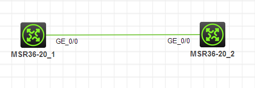
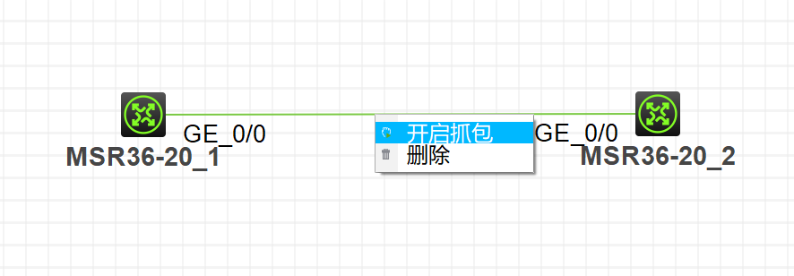
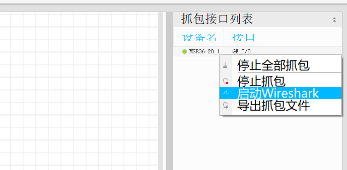
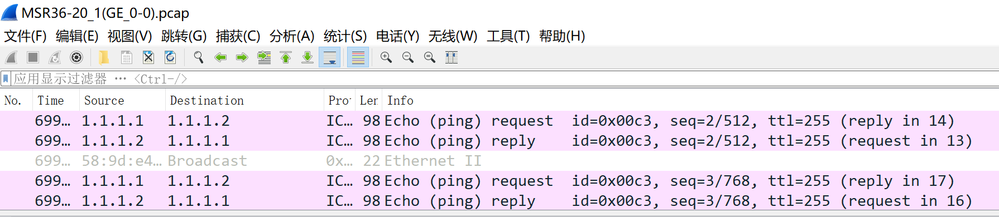
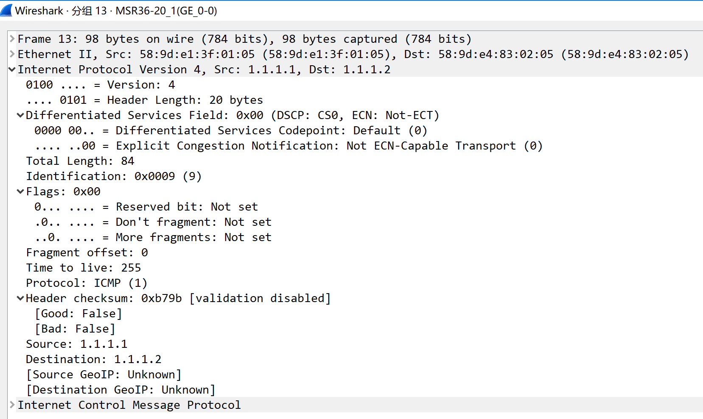
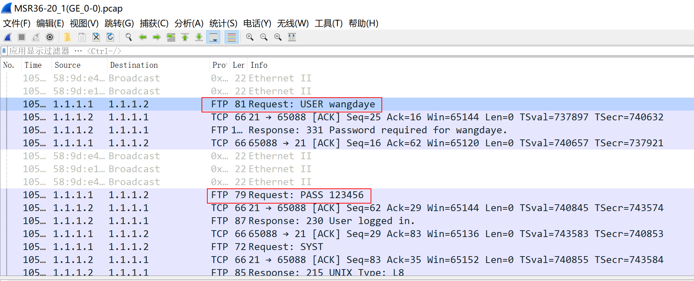

# IP和TCP抓包分析实验

## 实验拓扑

图1-1

> 注：如无特别说明，描述中的R1或SW1对应拓扑中设备名称末尾数字为1的设备，R2或SW2对应拓扑中设备名称末尾数字为2的设备，以此类推

---

## 实验需求  

1. 配置IP地址，R1的g0/0口是1.1.1.1/24，R2的g0/0口是1.1.1.2/24
2. 在该链路上开启抓包
3. 在R1上ping R2
4. 开启wireshark，查看抓取的ping包的内容
5. 在R2上开启FTP服务
6. 在R1上访问R2的FTP
7. 刷新wireshark，查看抓取的FTP的登录名和密码

---

## 实验解法  

1. ### 修改设备名称  

    *步骤1：在R1上进入系统视图，修改设备名称为R1*  

        <H3C>system-view
        System View: return to User View with Ctrl+Z.
        [H3C]sysname R1
        [R1]
    *步骤2：在R2上进入系统视图，修改设备名称为R2*  

        <H3C>system-view 
        System View: return to User View with Ctrl+Z.
        [H3C]sysname R2
        [R2]

2. ### 配置IP地址  

    *步骤1：在R1上进入g0/0接口的接口视图，配置IP地址为* `1.1.1.1/24`  

        [R1]interface g0/0
        [R1-GigabitEthernet0/0]ip address 1.1.1.1 24
    *步骤2：在R2上进入g0/0接口的接口视图，配置IP地址为* `1.1.1.1/24`  

        [R2]interface g0/0
        [R2-GigabitEthernet0/0]ip address 1.1.1.2 24

3. ### 开启抓包  

    *步骤1：右键点击R1和R2相连的链路，点击* `开启抓包` *，如图1-2所示*  

    
    
图1-2

4. ### 在R1上PING R2  

        [R1]ping 1.1.1.2
        Ping 1.1.1.2 (1.1.1.2): 56 data bytes, press CTRL_C to break
        56 bytes from 1.1.1.2: icmp_seq=0 ttl=255 time=1.000 ms
        56 bytes from 1.1.1.2: icmp_seq=1 ttl=255 time=1.000 ms
        56 bytes from 1.1.1.2: icmp_seq=2 ttl=255 time=0.000 ms
        56 bytes from 1.1.1.2: icmp_seq=3 ttl=255 time=1.000 ms
        56 bytes from 1.1.1.2: icmp_seq=4 ttl=255 time=1.000 ms

5. ### 开启Wireshark，查看抓取的Ping包内容  

    *步骤1：点开HCL右侧边栏，右键点击* `GE0/0` *接口，并点击启动* `Wireshark` *，如图1-3所示*  

    
    
图1-3

    *步骤2：在Wireshark中可以看到抓到的数据包，紫色高亮的就是Ping包，如图1-4所示*  

    
    
图1-4

    *步骤3：双击某个Ping包，查看数据包详细内容，展开* `Internet Protocol Version 4` *，可以查看到详细的IP头部格式，如图1-5所示*  

    
    
图1-5

6. ### 在R2上开启FTP服务，创建用户`wangdaye`，密码`123456`  

        [R2]ftp server enable 
        [R2]local-user wangdaye class manage 
        New local user added.
        [R2-luser-manage-wangdaye]password simple 123456
        [R2-luser-manage-wangdaye]authorization-attribute user-role level-15
        [R2-luser-manage-wangdaye]service-type ftp

7. ### 在R1上访问FTP服务，输入用户名和密码  
    <em>注意：FTP登录功能只能在用户视图下使用</em>

        <R1>ftp 1.1.1.2
        Press CTRL+C to abort.
        Connected to 1.1.1.2 (1.1.1.2).
        220 FTP service ready.
        User (1.1.1.2:(none)): wangdaye
        331 Password required for wangdaye.
        Password: 
        230 User logged in.
        Remote system type is UNIX.
        Using binary mode to transfer files.

8. ### 刷新Wireshark，发现已经抓取到FTP的登录名和密码，如图1-6所示  

    
    
图1-6

---

<a href="..\README.md">返回课程实验目录</a>

