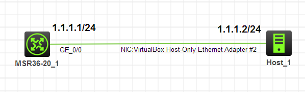
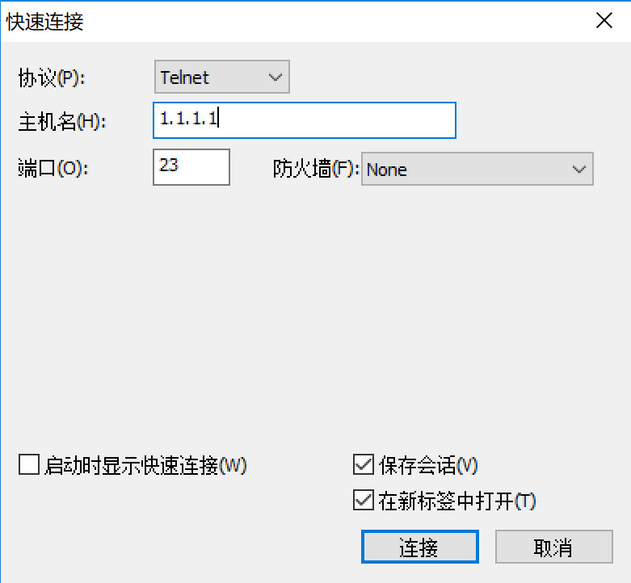
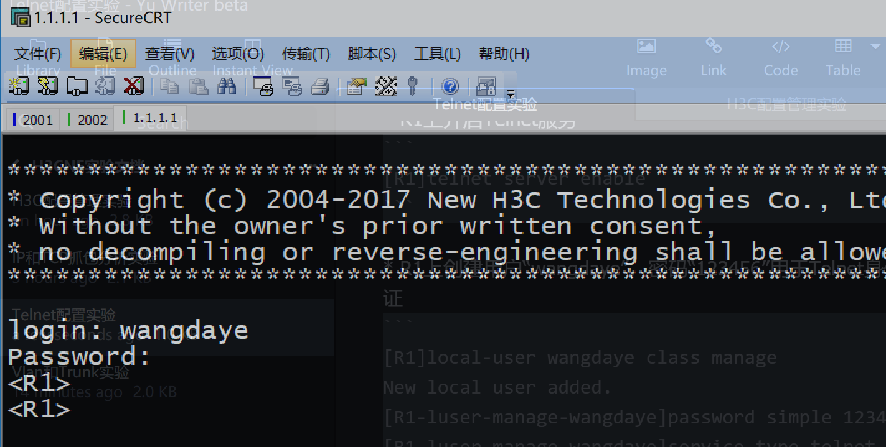

# Telnet配置实验

## 实验拓扑

图1-1

> 注：如无特别说明，描述中的R1或SW1对应拓扑中设备名称末尾数字为1的设备，R2或SW2对应拓扑中设备名称末尾数字为2的设备，以此类推

---

## 实验需求

1. 按照图示连接到真机，并配置IP地址（真机IP地址配置到VirtualBox Host-Only Ethernet Adapter网卡）
2. 在R1上开启Telnet服务，创建用户wangdaye，密码123456用于身份验证
3. 在真机上使用S-CRT通过Telnet登录R1

---

## 实验解法

1. 连接真机，配置IP地址步骤略  

2. R1上开启Telnet服务  

        [R1]telnet server enable

3. R1上创建用户“wangdaye”，密码“123456”用于Telnet身份验证  

        [R1]local-user wangdaye class manage 
        New local user added.
        [R1-luser-manage-wangdaye]password simple 123456
        [R1-luser-manage-wangdaye]service-type telnet 
        [R1-luser-manage-wangdaye]authorization-attribute user-role level-15

4. 在vty终端视图下配置Telnet验证模式为AAA验证，权限为Level-15  

        [R1]user-interface vty 0 4
        [R1-line-vty0-4]authentication-mode scheme 
        [R1-line-vty0-4]user-role level-15

5. 真机上使用CRT通过Telnet登录R1，CRT连接配置如图1-2所示，登录界面如图1-3所示  

    *步骤1：打开CRT，点击快速连接，协议选择* `Telnet` *，主机名为* `1.1.1.1` *，端口默认不变，然后点击连接，如图1-2所示*  

    
    
图1-2

    *步骤2：连接上R1上，提示login，输入用户名；提示Password，输入密码，按回车键，登录成功，如图1-3所示*

    
    
图1-3

---

<a href="..\README.md">返回课程实验目录</a>

